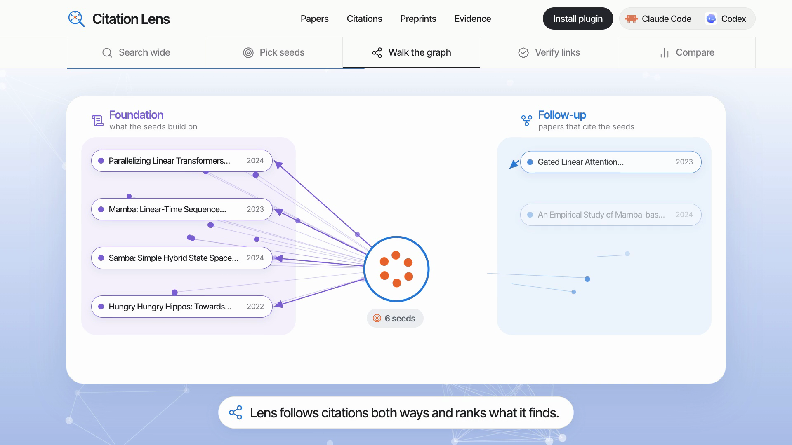
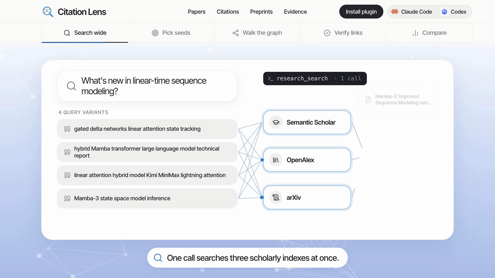
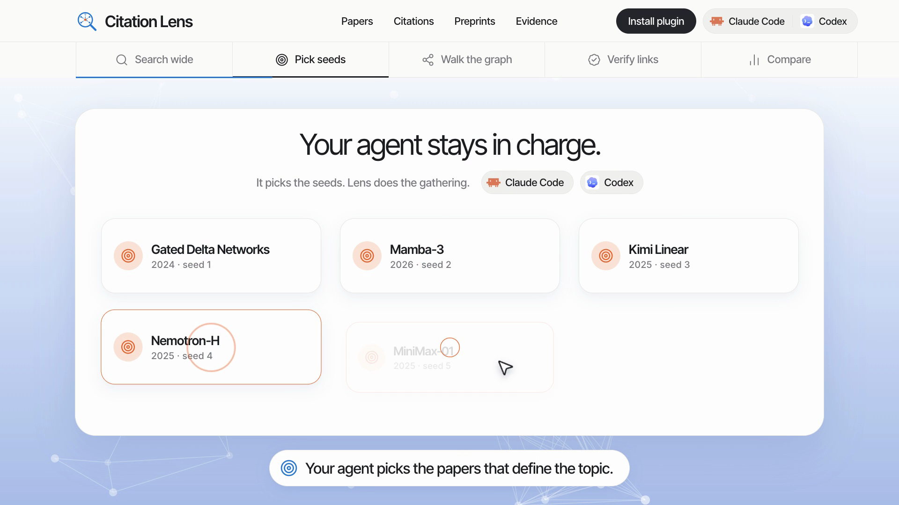
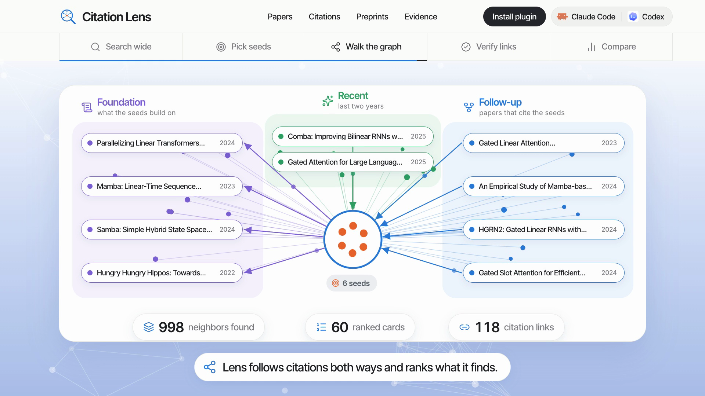
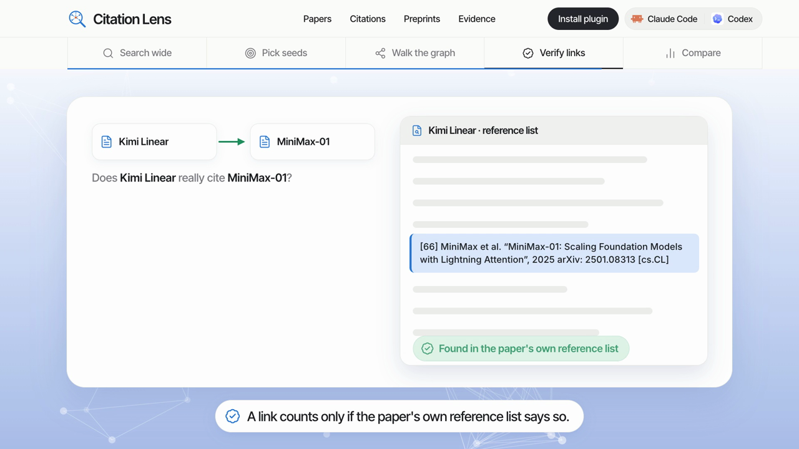
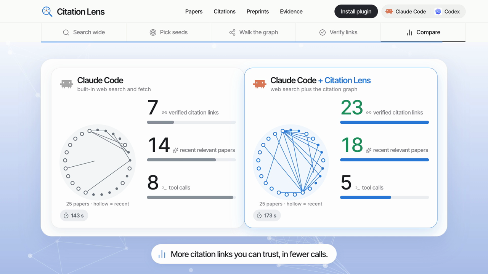

<p align="center">
  
</p>

<h3 align="center">Web search finds pages. Research needs a graph.</h3>

<p align="center">
  A literature-research plugin for <b>Codex</b> and <b>Claude Code</b>:<br>
  find the defining papers, follow their citations both ways, and keep only the links you can verify.
</p>

<p align="center">
  <a href="LICENSE"></a>
  
  
  
</p>

<p align="center">
  <a href="#install">Install</a> ·
  <a href="#see-it-work">See it work</a> ·
  <a href="demo/index.html">Side-by-side demo</a> ·
  <a href="docs/ARCHITECTURE.md">Architecture</a> ·
  <a href="docs/RESULTS.md">Results</a>
</p>

<p align="center">
  <a href="https://cdn.jsdelivr.net/gh/beingamanforever/Citation-lens@main/video/citation-lens.mp4"></a>
</p>

## Why Citation Lens

- **A graph, not a list.** From a few seed papers it walks references and citing papers like [Connected Papers](https://www.connectedpapers.com/about), and returns three lanes: foundations, follow-ups and what is new.
- **Links you can trust.** A citation counts only when the citing paper's own reference list says so; similarity is never reported as a citation.
- **Small, fast, parallel.** Every query runs on Semantic Scholar, OpenAlex and arXiv at once, and the agent gets compact cards, not whole papers.
- **The agent stays in charge.** Lens gathers, ranks and previews; the agent screens, verifies and writes.


## See it work

One recorded Claude Code run on "What's new in linear-time sequence modeling?", frame by frame from the video.

**1. Search wide.** One call fans every query variant out to Semantic Scholar, OpenAlex and arXiv.



**2. Pick seeds.** The agent chooses the papers that define the topic; Lens only gathers.



**3. Walk the graph.** Foundations on the left, follow-ups on the right, recent work on top: 998 neighbors ranked into 60 cards.



**4. Verify links.** A link is kept only if the paper's own reference list contains it.



**5. Compare.** The same agent with and without Citation Lens: verified links went from 7 to 23 and tool calls from 8 to 5, at the cost of 30 more seconds.
Across all 18 paired runs Lens verified more links in 13 and fewer in 4; the overall judge still preferred Claude alone, see [Results](#results).



Open [`demo/index.html`](demo/index.html) for a side-by-side replay of recorded runs, or read the [architecture diagrams](docs/ARCHITECTURE.md).

## How it works

1. **Search broadly, in parallel.** One call runs every query variant on Semantic Scholar, OpenAlex and arXiv at once, merges duplicate versions, and fuses the rankings.
   A recent lane reserves every third card for work from the last two years when available.
2. **Expand the citation graph.** From 3-6 seed papers Lens collects their references, their citing papers (newest from Semantic Scholar, most cited from OpenAlex) and Semantic Scholar's similar papers, then reads the candidates' own reference lists to measure bibliographic coupling and co-citation.
   Neighbors come back in three lanes: **foundation** (prior work the graph cites), **follow-up** (work that cites or resembles the seeds, ranked by shared references) and **recent** (the last two years).
3. **Preview, then read.** Compact cards identify the paper, explain its selection and carry a verbatim abstract excerpt.
   Abstracts, full text and figures are separate, on-demand calls.
   Snapshots page from a local cache without new requests.
   Complete cached abstracts read locally; publisher DOI aliases stay attached to arXiv records.
   Shared downloads, provider deadlines and throttling pauses avoid repeated work and bound waits.
4. **Cite real links.** Edges are citing -> cited pairs taken from reference lists.
   If citation indexes fail, arXiv bibliographies can supply backward links with a source fragment and matched paper ID; unresolved references remain visible.
   Crossref can resolve exact DOI metadata for those links and missing-evidence reads; it supplies paper metadata while the bibliography remains the edge proof.
   Shared references and similarity never become citation links.

The agent stays in charge of judgment: Lens gathers, ranks and previews; the agent screens, verifies and writes.

## Install

Requires Python 3.11+, [uv](https://docs.astral.sh/uv/getting-started/installation/) and Git.
Restart your agent after installing.

```bash
codex plugin marketplace add beingamanforever/Citation-lens
codex plugin add citation-lens@citation-lens
```

```bash
claude plugin marketplace add beingamanforever/Citation-lens
claude plugin install citation-lens@citation-lens
```

Optional API keys can increase provider access; their effect on end-to-end performance is not measured here.
Set `OPENALEX_API_KEY` ([OpenAlex settings](https://openalex.org/settings/api)) and `SEMANTIC_SCHOLAR_API_KEY` ([request form](https://www.semanticscholar.org/product/api#api-key-form)).

## Use

> Use Citation Lens to research memory-efficient exact attention: foundations, the most
> influential follow-ups and the newest work, with citation links.

In Claude Code you can also run `/citation-lens:research <topic>`.
[Tools, standalone MCP and scripting](docs/USAGE.md).

## Results

- **Codex:** on 10 held-out tasks, twice each, the order-swapped judge favored Lens in 17 of 20 pairs (one loss, two ties).
- **Claude Code:** Lens finds more verified citation links but does not yet beat Claude's own search overall (7 wins, 10 losses, 3 ties).

[Full tables, protocol, failures and reproduction](docs/RESULTS.md) · [Evaluation protocol](docs/EVALUATION.md)

[Design and research basis](docs/DESIGN.md) · [Privacy](docs/PRIVACY.md) ·
[Development](docs/PUBLISHING.md) · [MIT license](LICENSE)
