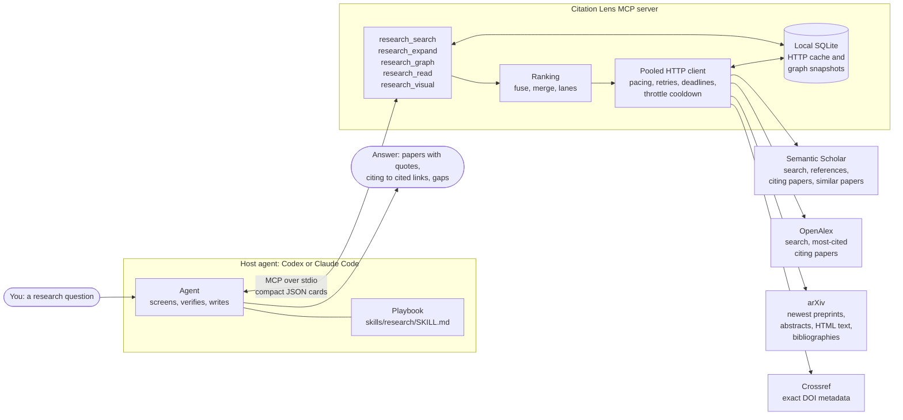
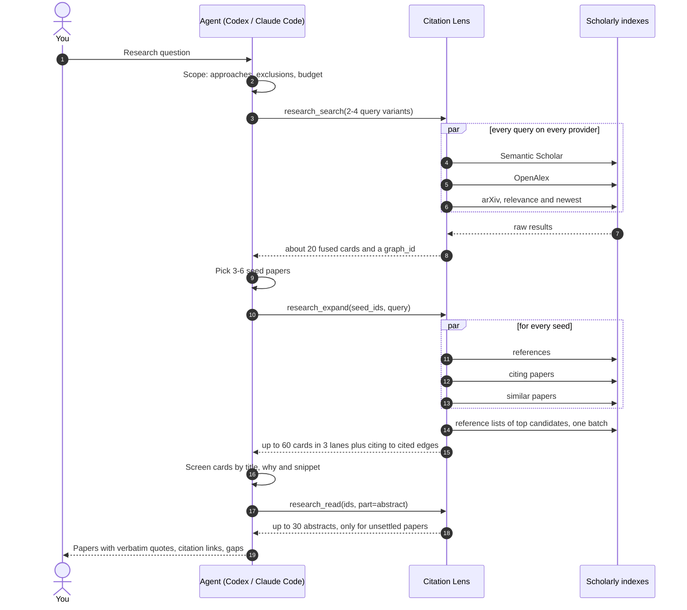
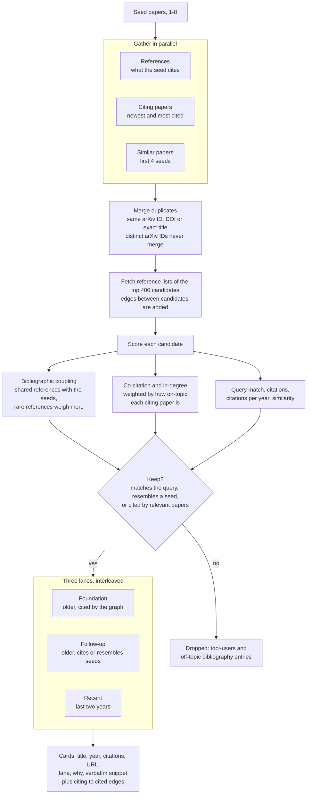
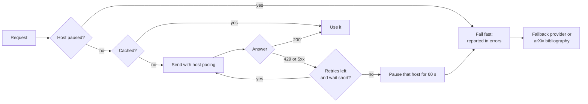
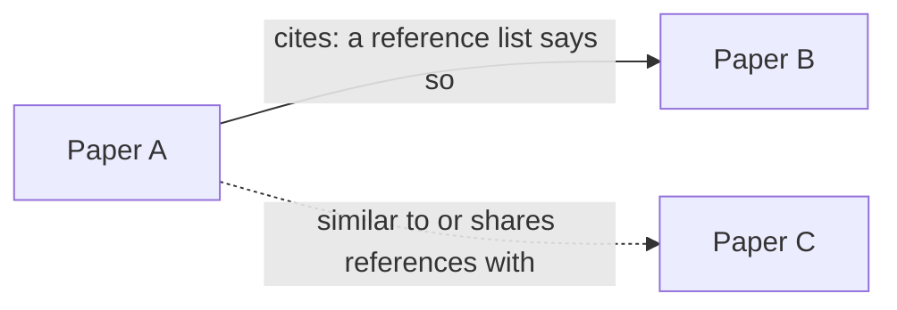

# Architecture

Citation Lens gives a coding agent (Codex or Claude Code) five research tools.
The agent decides what to search, which papers to trust and what to write.
Lens does the slow, parallel and bookkeeping-heavy work: querying scholarly indexes, walking the citation graph, ranking, caching and keeping each response small.

## The whole system

What stays in Lens: query fan-out, de-duplication, ranking, paging, caching.
What stays with the agent: deciding what counts as relevant and what to claim.

## One research session

A typical run is four Lens calls.
Search and expansion return cards, not papers; reading is on demand.

## What research_expand does

This is the Connected-Papers-style part.
One call turns a few seed papers into a ranked, labelled neighbourhood.

Each card says why it is there, for example `cites 3/3 seeds; shares 10 seed refs; cited by 3 graph papers`.
A card is about 500 bytes; pages hold at most 60 cards and 120 edges, and later pages come from the local snapshot without new requests.

## When providers fail

Free providers throttle, and Lens treats that as normal rather than fatal.

- Every provider call has its own deadline, so one slow index cannot hold a whole tool call.
- Failures are listed in the response (`errors`, `searches`), never silently dropped.
- Backward references can fall back from Semantic Scholar to OpenAlex, then to the paper's own arXiv bibliography; forward citations have no such primary source.

## Why edges can be trusted

Solid arrows are returned as edges, always `[citing, cited]`.
Similarity and shared references are labelled in each card's `why` and are never reported as citations.
