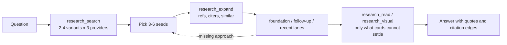

# Design

Goal: given a research question, return more relevant, verified papers than an agent's own web search - the foundations, the most influential follow-ups and the newest work - with citation links that can be checked.
Fast, and without flooding the agent's context.

## Principles

- **The host agent reasons; Lens gathers.** Five composable tools, no embedded LLM, no autonomous research loop.
  Codex or Claude Code decides what to search, which seeds to expand, what to read and what to conclude.
- **Preview first, detail on demand.** Search and expansion return compact cards; abstracts, text and figures are separate calls.
  Anthropic's tool guidance favors meaningful, bounded, paginated responses ([writing tools for agents][tools]).
- **Parallel by default.** One search call runs every query on every provider concurrently; one expansion fetches every seed's neighbors concurrently.
  Per-host pacing, retries and a local cache keep this polite and repeatable.
- **Provenance stays visible.** Citation edges come only from reference lists and always point citing -> cited.
  Similarity is labeled as similarity.
  Failed or throttled providers are reported, never silently dropped.
- **Recency is a lane, not a tie-break.** Citation counts lag; every result list reserves room for the last two years, including arXiv preprints too new for citation indexes.

## The paradigm: search, expand, screen, verify

Citation expansion is the most consistently supported recall lever in agentic literature search: removing PaSa's expansion step cut recall by 23-32% ([PaSa][pasa]); one-hop expansion lifted BM25 recall@20 from 50.0 to 68.6 on LitSearch ([LitSearch][litsearch]); SPAR keeps expansion shallow because deeper chains drift off topic ([SPAR][spar]).
Lens expands one hop per call and lets the agent re-seed.

## Providers

| Need | Source | Why |
| --- | --- | --- |
| Relevance search | Semantic Scholar, OpenAlex, arXiv | fused with reciprocal rank fusion |
| Fresh preprints | arXiv sorted by submission date | not yet in citation indexes |
| References | Semantic Scholar, OpenAlex fallback | OpenAlex lacks reference lists for many ML preprints |
| Citing papers | Semantic Scholar (newest 1000), OpenAlex (most cited, overall and last two years) | S2 lists citers newest-first; OpenAlex sorts by citations |
| Similar papers | Semantic Scholar recommendations | finds prominent follow-ups a newest-first citer list misses |
| Coupling data | one Semantic Scholar batch of reference IDs for up to 400 candidates | measures shared references |

Records merge on stable identifiers, or an exact long title with compatible author/year evidence and no conflicting identifiers.
Two different arXiv IDs never merge.
The arXiv abstract is preferred as verbatim text, and the larger citation count wins.

## Ranking

Search: `0.45 * fused rank + 0.25 * query match + 0.30 * citation percentile`, interleaved two relevance cards to one recent card.
Strict-AND providers (OpenAlex, arXiv) get the first four content words of a query so long phrasings still match.

Expansion follows Connected Papers, which ranks by co-citation and bibliographic coupling ([about][cp]), and Inciteful, which weights shared references by Adamic/Adar ([Inciteful][inciteful]):

- coupling: shared references with the seeds, each weighted `1 / log(2 + its citations)`, divided by `sqrt(reference count)` so long bibliographies do not win by size;
- co-citation: graph papers citing both the candidate and a seed;
- in-degree: graph papers citing the candidate;
- direct links and similar-to-seed recommendations; query match; citations and citations per year.

| Lane | Members | Score |
| --- | --- | --- |
| foundation | cited by a seed or by several relevant graph papers, older than two years | 0.45 in-degree, 0.15 co-citation, 0.2 match, 0.2 citations |
| follow-up | cites the graph or resembles a seed, older than two years | 0.3 coupling, 0.2 direct, 0.15 similar, 0.2 match, 0.15 velocity |
| recent | last two years | 0.25 coupling, 0.15 direct, 0.15 similar, 0.3 match, 0.15 velocity |

Graph signals are percentiles within the candidate pool.
In-degree and co-citation weigh each citing paper by its own query match (a seed counts fully), so papers that merely use a seed as a tool do not become foundations.
A candidate stays if it matches the query, resembles a seed, or is cited by relevant papers worth at least 1.5 (two seeds suffice).
Lanes are interleaved round-robin; each card names its lane and why it was chosen ("cited by 2/3 seeds; shares 12 seed refs").

## Context budget

Measured in the evaluation runs (development iteration 4 and held-out):

| Response | Size |
| --- | --- |
| Search, 20 cards | about 8 KB (20-27 KB when an agent asks for 45-60 cards) |
| Expansion, 60 cards and at most 120 edges | 33-37 KB |
| 25-30 abstracts in one read (first 1000 characters each) | 32-40 KB |
| Whole Lens attempt | 106 KB on average |

Each card carries one verbatim abstract sentence chosen for the query, so the agent can quote evidence without another call.
Pages clamp to 60 cards and 120 edges, keeping the links that touch seeds and top-ranked cards.
The previous design returned 45-120 KB per call, about 230 KB per attempt, and timed out in two of three attention trials.

## Limits

Keyless providers throttled during the evaluations.
Optional API keys can increase provider access; their effect on research quality, latency and tokens has not been measured.
A host that stays throttled through every retry is skipped for a minute, so a saturated provider costs one failed call rather than every call.
Citation indexes lag new preprints.
Similarity recommendations cover computer science only.
The graph is one hop per call, not a full corpus like Connected Papers'.
Ranking weights are heuristics tuned on development tasks, not learned.

[tools]: https://www.anthropic.com/engineering/writing-tools-for-agents
[pasa]: https://arxiv.org/abs/2501.10120
[litsearch]: https://arxiv.org/abs/2407.18940
[spar]: https://arxiv.org/abs/2507.15245
[cp]: https://www.connectedpapers.com/about
[inciteful]: https://incitefulmed.com/academic/help/paper-disovery-explained.html
