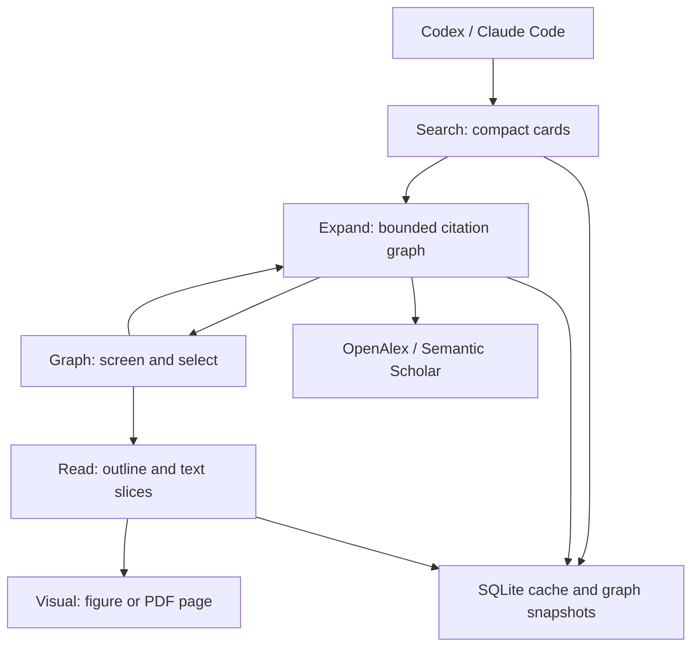

# Citation Lens: research and reviewed design

Goal: enable Codex and Claude Code to search a topic, snowball forward and backward,
screen candidates, read selected evidence including visuals, then synthesize a cited review.

## Research findings

- Wohlin's snowballing guidance supports iterative reference and citation screening,
  with explicit inclusion/exclusion criteria and a defensible starting set:
  https://www.wohlin.eu/ease14.pdf
- Connected Papers uses co-citation and bibliographic coupling, not just a citation
  tree. Citation Lens deliberately preserves direct, directed citations as a graph:
  https://www.connectedpapers.com/about
- This capability already exists in part. scholar-mcp has BFS traversal, citation
  discovery, caching, and paged PDF conversion. papers-mcp has arXiv extraction
  with figures/tables. We cannot claim citation traversal as novel:
  https://github.com/pvliesdonk/scholar-mcp
  https://github.com/wbopan/papers-mcp
- PaperQA supplies evidence-oriented document retrieval. It is a larger RAG system;
  here the existing harness performs screening and synthesis, avoiding another LLM
  service, vector database, orchestration layer, and duplicate model costs:
  https://github.com/Future-House/paper-qa
- OpenAlex provides server-side citation filtering, sorting, field selection,
  cursor paging, and batched ID resolution. Current docs cap a page at 100 and an
  OR filter at 100. API keys improve anonymous budgets:
  https://help.openalex.org/api/llm-quick-reference/
  https://help.openalex.org/api/authentication/
- Semantic Scholar supports arXiv/DOI IDs, citation contexts, and batched metadata
  (500 IDs). Citation paging is not a guarantee of global citation-count ranking:
  https://api.semanticscholar.org/graph/v1/swagger.json
- Native arXiv HTML offers math, table structure, captions, and figure URLs. PDF
  text alone cannot faithfully describe diagrams. Expose the original PDF page
  or figure as an MCP image when the harness needs visual evidence:
  https://arxiv.org/html/1706.03762
- Jina Reader is a useful optional PDF/HTML fallback, but generated image captions
  are not equivalent to seeing a figure and must not become authoritative evidence:
  https://github.com/jina-ai/reader
- Anthropic recommends meaningful, bounded tool responses and behavioral evals:
  https://www.anthropic.com/engineering/writing-tools-for-agents
- Codex and Claude Code support stdio MCP and packaged skills. Public OpenAI
  directory submission of MCP plugins currently requires a remote HTTPS endpoint;
  a local marketplace release is a distinct distribution route:
  https://developers.openai.com/codex/mcp
  https://developers.openai.com/plugins/build/plugins
  https://code.claude.com/docs/en/plugins-reference

## Plan review and refinements before implementation

| Initial idea | Problem | Refined design |
| --- | --- | --- |
| Citation tree | Shared ancestors, cross-links, cycles get duplicated | Canonical IDs and directed edge set |
| Expand every paper recursively | Exponential requests and unrelated hubs | Explicit depth, beam, node and neighbor limits |
| Most-cited only | Disadvantages recent work | Interleave relevant, recent, prominent candidates |
| Entire PDFs in context | Token flood and poor selection | Cards, outline, text slices, selected visual |
| Automatic LLM summaries | Cost, latency, unsupported compression | Abstract excerpts clearly labeled; harness writes evidence summaries |
| Text-only extraction | Loses diagrams and PDF layout | HTML structure plus actual figure/page image |
| Silent fallback | Hides gaps and index drift | Provider identity, sampling counts, errors, source URLs |
| Build an autonomous research agent | Duplicates Codex/Claude reasoning | Five composable tools plus workflow guidance |

## Architecture

Edges always point from citing paper to cited paper. Traversal in either direction
never reverses stored edges. No claim that a citation implies support.

## Budgets and selection

Default one hop, at most three; beam <= 8; graph <= 200 nodes; neighbors <= 40
per seed per direction; text <= 12,000 characters per call. Pagination is explicit.
MCP uses one compact JSON text block to avoid duplicate structured/text payloads.
Each response includes its serialized UTF-8 byte count; this is an exact payload
measurement, not a tokenizer-independent token claim. No full paper at discovery.
OpenAlex samples both latest and most cited forward links, and batch-fetches
backward references. Semantic Scholar samples bounded pages with a continuation
and warning. Ranking is a transparent heuristic, never a SOTA or quality score.

Requests share a pooled async HTTP client, bounded concurrency, per-host pacing,
retry-after-aware bounded retries, timeouts, byte limits, and persistent TTL cache.
Single-flight coalesces identical in-process requests. No provider payload or
credential is dumped into model context. Graph snapshots are resumable after restart.

Native arXiv discovery includes preprints not yet in citation indexes and marks
unresolved citation counts explicitly. Explicit arXiv revisions remain pinned.

## Evidence and visuals

HTML preferred when an arXiv ID exists. Preserve LaTeX annotations, Markdown tables,
figure captions and URLs. PDF fallback retains page boundaries and supports page
rendering. Text extraction warnings remain attached. Chunk offsets give lossless
access to all stored text, with provenance URL and content hash. A figure/page
image is requested separately, with caption/page identity. Nonvisual clients must
report missing visual inspection. Neither abstracts nor captions prove SOTA.

## Tool efficiency refinement

The shared search tool accepts scalar inputs or up to three query variants across three providers.
Batching uses the existing HTTP pool and pacing; it does not add another tool or orchestration service.
Each attempt retains coverage or failure, identity aliases and contributing search indexes.
Equivalent records prefer the earliest indexed full-text source without blending provider metrics.
The discovery snapshot stores all candidates and returns ten cards; cached pages recover the rest.
The bundled MCP Python client can filter those pages before printing its final result.
Text pagination returns overview and figures once, preserving every text character and source warning.

[Advanced tool use](https://www.anthropic.com/engineering/advanced-tool-use) distinguishes host/API tool search and programmatic calling from server tools.
[Code execution with MCP](https://www.anthropic.com/engineering/code-execution-with-mcp) motivates keeping intermediate results in the client.
[Effective tool design](https://www.anthropic.com/engineering/writing-tools-for-agents) motivates bounded responses and executable usage examples.
We measure complete as well as initial payloads; disjoint discovery can cost more because it retains provenance.

## Scope and ceilings

No scraping paywalls, GPU OCR, automatic claim generation, full-corpus graph, or
hosted multi-user server in v0.1. Cross-provider records deduplicate by DOI/arXiv
when available; title-only fuzzy merging is intentionally avoided. Metadata is
incomplete and can lag recent preprints. Discovery is a bounded map, not a
systematic-review completeness guarantee. Current best directions require reading
methods/results and comparing compatible tasks, datasets, splits and compute.

## Verification and release gates

Deterministic provider contract fixtures; graph cycles/shared ancestors/direction;
node/depth caps; recent low-citation inclusion; partial errors; cache TTL and
single-flight; byte budgets; HTML math/tables/captions; PDF text and image;
SSRF/redirect/input boundaries; SDK stdio initialization/tools/calls; build and
manifest validation. Benchmark cached vs cold fixture requests and card vs document
payloads. These measurements do not establish real internet latency or research
quality. Live topic runs and blinded human screening remain gates for research
quality claims and a stable release. The initial distribution is a preview.
